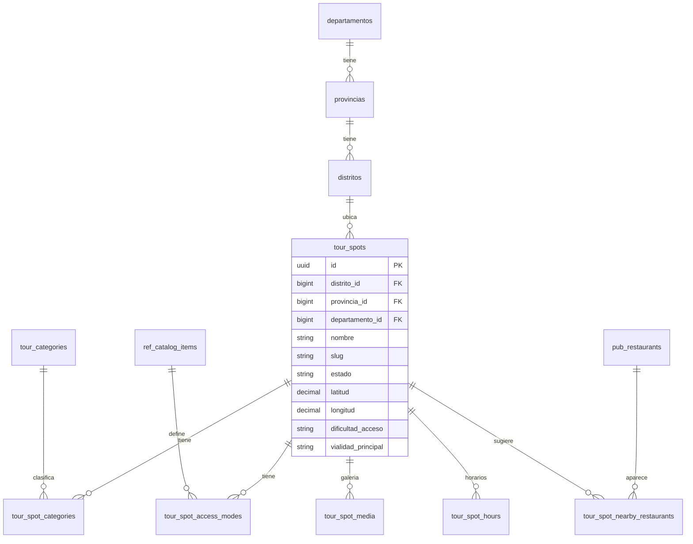

# Arquitectura de datos — Centros turísticos (VanPe Admin)

> Documento de arquitectura de datos para el módulo **administrativo** de centros / atractivos turísticos.
> Alcance: plataforma central (`public`), cargado por superadmin/staff VanPe.
> No forma parte del schema de tenant (`rst_*`).

**Fecha:** 2026-07-20  
**Estado:** propuesta de diseño (sin migraciones aún)  
**Relacionado:** `ANALISIS_VIABILIDAD_VANPE.md`, `vanpe_db_completo.md` (§14–16), catálogo geo existente.

---

## 1. Objetivo

Permitir que la **administración VanPe** registre, clasifique y publique **centros turísticos** (museos, playas, sitios arqueológicos, templos, miradores, etc.) para que la app del turista pueda descubrirlos y, más adelante, relacionarlos con restaurantes cercanos.

Principios:

1. **Reutilizar** el catálogo geográfico ya operativo (`paises` → `departamentos` → `provincias` → `distritos`).
2. **No duplicar** ubigeo con `geo_regions` / `geo_ubigeos` del diseño antiguo, salvo que más adelante se necesite una capa operativa de expansión comercial.
3. Un centro turístico **vive a nivel distrito** (hoja geográfica); departamento y provincia se denormalizan para filtros rápidos (mismo patrón que `tenants` / `pub_restaurants`).
4. Separar **qué es** (categoría) de **cómo se llega** (acceso / vialidad / dificultad).
5. Diseño listo para app turista y ranking, sin acoplarse aún a reseñas/reservas.

---

## 2. Qué ya existe (reutilizar)

| Recurso | Uso en este módulo |
|--------|---------------------|
| `departamentos`, `provincias`, `distritos`, `paises` | Ubicación obligatoria del atractivo |
| `ref_catalog_items` + `RefCatalogTypes` | Taxonomía genérica; **extender** con tipos nuevos de acceso/vialidad (opcional pero recomendado) |
| Patrón `pub_restaurants` | Modelo de ficha pública: slug, geo, media, flags `activo`/`destacado`, ratings agregados |
| Panel Platform + permisos | CRUD solo en dominio central (`tenant.none`) |
| Import geo VetSaaS | Ya alimenta distritos; no hace falta otro INEI paralelo |

**No crear** en Fase 1:

- `geo_ubigeos` plano (redundante con la jerarquía actual).
- `geo_regions` / `geo_zones` como sustituto de departamento/distrito (sí pueden existir después como **agrupaciones editoriales**, no como ubigeo oficial).

---

## 3. Decisiones de modelo

### 3.1 Ancla geográfica

```
distrito_id     → REQUIRED (fuente de verdad geográfica)
provincia_id    → denormalizado (sync desde distrito)
departamento_id → denormalizado (sync desde provincia)
```

Regla de aplicación:

- El formulario admin elige cascada Dep. → Prov. → Dist.
- Al guardar, se persisten los tres IDs.
- Si alguien mueve el distrito en el futuro, un job/command puede reconciliar denormalización.

### 3.2 Categoría vs atributos de acceso

| Concepto | ¿Qué responde? | Modelo |
|----------|----------------|--------|
| **Categoría** | ¿Qué tipo de lugar es? (museo, playa, religioso…) | Tabla `tour_categories` + N:M |
| **Acceso** | ¿Cómo se llega? (a pie, auto, bus…) | Catálogo `ref_catalog_items` tipo `tour_access` + N:M |
| **Vialidad** | ¿Cómo es el camino? (asfalto, afirmado, trocha, sendero) | Catálogo tipo `tour_road` (1 principal + opcionales) |
| **Dificultad / esfuerzo** | ¿Qué tan exigente es llegar o recorrer? | Enum en la ficha principal |
| **Práctico** | Horarios, ticket, parking, baños, accesibilidad | Columnas + JSON controlado |

**¿Por qué categoría dedicada y no solo `ref_catalog`?**  
Las categorías turísticas son contenido de producto (icono, color, orden editorial, destacados). Merecen tabla propia con UX admin específica.  
Los modos de acceso/vialidad sí encajan en `ref_catalog_items` (listas cortas, i18n `name_es`/`name_en`, mismos seeds/CRUD de catálogo).

### 3.3 Identidad

- PK: `UUID` (alineado a `pub_*`, `tenants`, `ref_catalog_items`).
- `slug` único global en `public`.
- Soft delete (`deleted_at`) para no romper deep links / favoritos futuros.

---

## 4. Diagrama de entidades



---

## 5. Tablas propuestas

Prefijo de módulo: **`tour_`** (contenido turístico de plataforma), coherente con `vanpe_db_completo.md` y distinto de `pub_` (proyección de restaurantes).

### 5.1 `tour_categories` — tipo de centro

| Columna | Tipo | Notas |
|---------|------|--------|
| `id` | uuid PK | |
| `slug` | varchar(80) unique | `museo`, `playa`, `arqueologico`… |
| `name_es` / `name_en` | varchar(100) | i18n |
| `icon` | varchar(40) null | lucide / key UI |
| `color_hex` | varchar(7) null | badges app |
| `sort_order` | smallint | |
| `active` | boolean | |
| timestamps | timestamptz | |

**Seed inicial sugerido:** religioso, arqueológico, museo, playa, naturaleza, mirador, gastronómico (mercados/ferias), histórico-urbano, aventura, cultural-vivo.

Un spot puede tener **varias categorías** (ej. museo + religioso) vía pivot.

### 5.2 Extensión de `ref_catalog_items` — acceso y vialidad

Nuevos `type` en `RefCatalogTypes`:

| `type` | Ejemplos de `slug` |
|--------|---------------------|
| `tour_access` | `a_pie`, `auto`, `moto`, `bicicleta`, `transporte_publico`, `taxi_colectivo`, `4x4`, `lancha` |
| `tour_road` | `asfaltado`, `afirmado`, `trocha`, `sendero_peatonal`, `escaleras`, `mixto` |
| `tour_amenity` (opcional F2) | `estacionamiento`, `banos`, `wifi`, `guia`, `accesible_silla`, `zona_sombra`, `ventas_locales` |

No requiere tabla nueva: reutiliza seeds + panel de catálogo existente, con tabs nuevos.

### 5.3 `tour_spots` — ficha principal

| Columna | Tipo | Regla |
|---------|------|--------|
| `id` | uuid PK | |
| `departamento_id` | FK nullable→required en app | denormalizado |
| `provincia_id` | FK | denormalizado |
| `distrito_id` | FK **required** | ancla |
| `nombre` | varchar(150) | |
| `slug` | varchar(160) unique | |
| `resumen` | varchar(300) null | card app |
| `descripcion` | text null | detalle |
| `direccion` | varchar(255) null | texto libre |
| `referencia` | varchar(255) null | “frente al parque…” |
| `latitud` / `longitud` | decimal(9,6) **required** si `publicado` | mapa |
| `altitud_msnm` | integer null | opcional |
| `telefono` / `whatsapp` / `website` / `email` | nullables | contacto |
| `precio_entrada_desde` | decimal(10,2) null | |
| `precio_entrada_hasta` | decimal(10,2) null | |
| `moneda` | char(3) default `PEN` | |
| `es_gratuito` | boolean default false | |
| `requiere_reserva` | boolean default false | futuro |
| `dificultad_acceso` | enum string | `facil` \| `moderado` \| `dificil` \| `extremo` |
| `vialidad_principal` | varchar / FK lógica a slug `tour_road` | camino dominante |
| `tiempo_acceso_min` | smallint null | desde el pueblo/distrito típico |
| `distancia_acceso_km` | decimal(6,2) null | |
| `acceso_notas` | text null | “últimos 2 km en trocha; no entrar con sedán” |
| `estacionamiento` | enum | `ninguno` \| `calle` \| `privado_gratis` \| `privado_pago` \| `desconocido` |
| `accesible_movilidad_reducida` | boolean null | tri-state vía null |
| `mejor_epoca` | varchar(120) null | “mayo–octubre” |
| `duracion_visita_min` | smallint null | |
| `tips` | jsonb null | lista corta validada `{ "es": [], "en": [] }` |
| `como_llegar` | jsonb null | pasos estructurados (ver §6) |
| `imagen_portada_url` | varchar(500) null | |
| `rating_promedio` | decimal(3,2) default 0 | futuro |
| `total_resenas` | int default 0 | futuro |
| `destacado` | boolean | |
| `destacado_hasta` | timestamptz null | |
| `score_ranking` | decimal(8,4) default 0 | |
| `estado` | enum | `borrador` \| `publicado` \| `pausado` \| `archivado` |
| `publicado_en` | timestamptz null | |
| `created_by` / `updated_by` | FK users null | auditoría ligera |
| timestamps + `deleted_at` | | |

**Índices:**

- `(departamento_id, estado)`
- `(distrito_id)`
- `(latitud, longitud)`
- `(score_ranking)` where publicado
- unique `slug`
- GIN opcional sobre `tips` / búsqueda full-text más adelante

### 5.4 `tour_spot_categories` (N:M)

| Columna | Tipo |
|---------|------|
| `tour_spot_id` | uuid FK cascade |
| `tour_category_id` | uuid FK restrict |
| `is_primary` | boolean default false |
| PK compuesta `(tour_spot_id, tour_category_id)` |

Regla: exactamente **una** categoría primaria por spot (enforced en app; check parcial opcional).

### 5.5 `tour_spot_access_modes` (N:M con catálogo)

| Columna | Tipo |
|---------|------|
| `tour_spot_id` | uuid FK |
| `ref_catalog_item_id` | uuid FK → `ref_catalog_items` where type=`tour_access` |
| `recomendado` | boolean default false | “forma recomendada” |
| `notas` | varchar(200) null | |

### 5.6 `tour_spot_media`

Igual espíritu que fotos de restaurante / diseño `tour_spot_media`:

| Columna | Tipo |
|---------|------|
| `id` | uuid |
| `tour_spot_id` | uuid FK cascade |
| `tipo` | `imagen` \| `video` |
| `url` | varchar(500) |
| `caption` | varchar(200) null |
| `sort_order` | smallint |
| `is_cover` | boolean | alternativa a `imagen_portada_url` |

### 5.7 `tour_spot_hours` (opcional Fase 1.5)

Horario semanal estructurado (mejor que solo texto):

| Columna | Tipo |
|---------|------|
| `tour_spot_id` | uuid |
| `weekday` | 0–6 (dom–sáb) |
| `abre` / `cierra` | time null | null + `cerrado=true` |
| `cerrado` | boolean |

Mantener también `horario_texto` en `tour_spots` para casos irregulares (“solo feriados”, “con cita”).

### 5.8 `tour_spot_nearby_restaurants` (Fase 2 — vínculo marketplace)

| Columna | Tipo |
|---------|------|
| `tour_spot_id` | uuid |
| `pub_restaurant_id` | uuid FK `pub_restaurants` |
| `distancia_m` | int null | calculada o manual |
| `sort_order` | smallint |
| `activo` | boolean |

Permite “cerca de Sipán” en la app sin joins geo costosos en caliente.

---

## 6. JSON controlados (evitar basura)

### `como_llegar` (ejemplo)

```json
{
  "es": [
    { "modo": "auto", "texto": "Desde Chiclayo tomar la vía a Lambayeque (25 min)." },
    { "modo": "a_pie", "texto": "Desde el paradero, 8 min caminando por vereda." }
  ],
  "en": [
    { "modo": "auto", "texto": "From Chiclayo take the road to Lambayeque (25 min)." }
  ]
}
```

`modo` debe coincidir con slugs de `tour_access`.

### `tips`

```json
{
  "es": ["Llevar agua", "Protector solar", "No drones sin permiso"],
  "en": ["Bring water", "Sunscreen", "No drones without permit"]
}
```

Validar longitud y cantidad máxima en FormRequest (ej. máx. 8 tips × 120 chars).

---

## 7. Estados y publicación

```
borrador → publicado → pausado
                ↘ archivado
```

- Solo `publicado` es visible en API turista.
- `pausado`: oculto sin borrar ranking/historial.
- Publicar exige: `distrito_id`, coords, ≥1 categoría, portada, slug.

---

## 8. Capas de aplicación (admin)

| Capa | Responsabilidad |
|------|-----------------|
| **Permisos** | `tour_spots.view`, `tour_spots.create`, `tour_spots.update`, `tour_spots.publish`, `tour_spots.delete` en `config/permissions.php` → scope `platform` |
| **Controller** | `Platform\TourSpotController` (Inertia), patrón `TenantController` / `CatalogController` |
| **Services** | `TourSpotWriter` (cascada geo, slug, sync denormalizada), `TourSpotPublisher` |
| **API turista (después)** | `GET /api/v1/tourist/spots` lectura solo publicados; filtros por `departamento_id`, categoría, acceso, bbox |
| **Jobs** | recompute `score_ranking`; geocode opcional; sync distancias a restaurantes |

---

## 9. Consultas típicas (contratos)

### Admin listado

Filtros: departamento, provincia, distrito, categoría, estado, texto, destacado.

### App turista (futuro)

1. Por cercanía: `ORDER BY earth_distance / Haversine` + `estado = publicado`.
2. Por departamento + categoría.
3. “Llegada en auto + vialidad asfaltado|afirmado”.
4. Destacados home.

---

## 10. Relación con el diseño antiguo (`vanpe_db_completo.md`)

| Diseño antiguo | Decisión ahora |
|----------------|----------------|
| `geo_ubigeos` | **No**; usar `distritos` (+ padres) |
| `geo_regions` / `geo_zones` | **Diferir**; posible Fase 3 como “zonas editoriales” (`tour_zones`) sin reemplazar ubigeo |
| `tour_categories` | **Sí**, casi igual |
| `tour_spots` | **Sí**, anclado a distrito + campos de acceso/vialidad |
| `tour_spot_media` | **Sí** |
| `tour_events` / `tour_routes` | **Fase 3+** (después de tener masa de spots) |

---

## 11. Fases de implementación

### Fase A — Fundamentos (admin usable)

1. Seeds `tour_categories`.
2. Extender `RefCatalogTypes` + seed `tour_access` / `tour_road`.
3. Migraciones `tour_spots`, pivots categorías/acceso, `tour_spot_media`.
4. CRUD Inertia + permisos + cascada geo.
5. Validaciones de publicación.

### Fase B — Calidad de dato

1. `tour_spot_hours`.
2. Auditoría `created_by`.
3. Import CSV masivo (distrito por nombre/id).
4. Ranking básico (`destacado`, manual score).

### Fase C — App turista

1. Endpoints lectura.
2. Mapa + filtros acceso/categoría.
3. `tour_spot_nearby_restaurants` (automático por radio o curado).

### Fase D — Producto avanzado

1. Rutas / eventos.
2. Reseñas unificadas (`app_reviews` polimórficas).
3. Zonas editoriales opcionales.

---

## 12. Campos mínimos vs recomendados (checklist producto)

**Mínimo para publicar**

- Nombre, slug, distrito, lat/lng  
- ≥1 categoría  
- Portada  
- Resumen  
- Al menos 1 modo de acceso  
- Vialidad principal o notas de acceso  

**Recomendado**

- Descripción, tips, cómo llegar estructurado  
- Horario, precio / gratuito  
- Estacionamiento, dificultad, tiempo/distancia de acceso  
- WhatsApp / web  
- Galería ≥3 fotos  

---

## 13. Riesgos y mitigaciones

| Riesgo | Mitigación |
|--------|------------|
| Duplicar geo (regions vs distritos) | Una sola fuente: ubigeo actual |
| Spots sin coords útiles | Bloquear publicación sin lat/lng |
| Categorías infinitas | Seed cerrado + alta controlada por admin |
| “Trocha” mal tipificada | Catálogo `tour_road` + texto libre solo en `acceso_notas` |
| Denormalización desfasada | Writer centralizado + comando `tour:geo-reconcile` |
| Contaminar `ref_catalog` | Prefijo de types `tour_*` y UI filtrada |

---

## 14. Resumen ejecutivo

- El centro turístico **pertenece a un distrito**; departamento/provincia van denormalizados para filtros.
- **Categoría** = qué es el lugar (tabla propia + N:M).
- **Acceso y vialidad** = cómo se llega / cómo es el camino (catálogo `ref_*` + N:M / campo principal).
- Media, horarios y vínculo a restaurantes se separan para no inflar la ficha.
- Encaja con el admin actual y deja lista la API turista sin rehacer geo.

Cuando apruebes este documento, el siguiente paso natural es: migraciones + seeds + permisos + pantalla Platform `Centros turísticos`.
